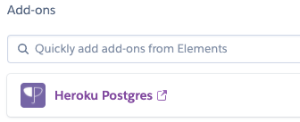

# **JP Performance Cars**
This is a project to build JP Performance Cars website.

## **Goal for this project**

JP Performance Cars, a supreme supercar specialist in the West Midlands UK.
Take a look at our website to see what services we offer, prices and previous work.
Book in your car for sevice or browse the website for cars we have on sale.

This project is for my final project to complete the full stack development course with **Code Institute** and to also build a website which allows customers to book there car in for a service. JP Performance Cars also has super cars and sports cars for sale this website will allow me to also implement a way for users to see what is for sale.

Thanks for taking a look at my project :)
If there are any improvements, questions or anything at all then please get in touch.

 ## Contents 
* [User Experience](#user-experience)
    * [User Goals](#user-goals)
    * [User Stories](#user-stories)
    * [Site Owners Goals](#site-owners-goals)
    * [User Requirements and Expectations](#user-requirements-and-expectations)
        * [Requirements](#requirements)
        * [Expectations](#expectations)
    * [Design Choices](#design-choices)
        * [Fonts](#fonts)
        * [thoughts](#thoughts)
        * [Colors](#colors)
        * [Structure](#structure)
* [Wireframes and Flowcharts](#wireframes-and-flowcharts)
    * [Wireframes](#wireframes)
    * [Flowcharts](#flowcharts)
    * [Database Structure](#database-structure)
* [Features](#features)
    * [Existing Features](#existing-features)
    * [Future Features](#future-features)
* [Technologies used](#technologies-used)
    * [Languages](#languages)
    * [Libraries and Frameworks](#libraries-and-frameworks)
    * [Tools](#tools)
* [Testing](#testing)
* [Bugs](#bugs)
* [Deployment](#deployment)
    * [Local Deployment](#local-deployment)
    * [Heroku Deployment](#heroku-deployment)
* [Credits](#credits)

## **User Experience**
### **User Goals**
* The landing page should give a good impression and motivate the user to want to browse around the website.
* The website has to be responsive on devices such as mobiles, tablets and desktop PCs.
* The Ability to see the cars which are for sale from JP Performance Cars.
* The Ability to book in your car for an annual service or major service.
* Have some information about JP Performance Cars previous work completed.
* Visually appealing website
* Be able to contact JP Performance Cars to enquire about a car which is for sale.

### **User Stories**
As a **user**:  
* I want the website to be visually attractive to capture my attention.
* I want to have some information about JP Performance Cars such as location, services and more.
* I want to have an intuitive navigation so I can access information straight away.
* I want to see what cars are for sale.
* I want to search cars for sale.
* I want to see pictures of all the cars JP Performance Cars have on sale.
* I want to be able to make a booking to have my super/sports car serviced for either annual or major service.
* I want to see what the deposit price is for booking my car in.
* I want to see information about the car for sale.

### **Site Owner Goals**
As an **owner**:  
* I want to promote the business in the best way possible.
* I want to increase bookings by making the booking process easy and intuitive.
* I want to be able to see all the bookings.
* I want to have a deposit for a booking to be made to avoid spam bookings.
* I want to be able CRUD functions for cars for sale.
* I want to be able to see which parts/cars are the most popular by number of page views.
* I want to to be able to easily change the home page.

### **User Requirements and Expectations**
**Requirements**
* Visually appealing/attractive landing page and website.
* The possibility to book in car for a service.
* The possibliity to view my previous/upcoming services.
* Easy and intuitive to navigate round the website.
* Easy and intuitive to use on mobile.
* Ability to contact and enquire.
* Find information about location, service prices and more.
* To see imagery of all types of work and business that JP Performance Cars offers.

**Expectations**
* When making a booking I expect an email notification with confirmation and details about my booking.
* When clicking a link I expect to be taken to the correct page without errors.
* When navigating to the account page I expect to see details about my booking.
* When viewing a car for sale I expect the details on the specific car for sale to be accurate and have imagery.
* When making a booking I expect the process to be clear and intuitive.

### **Design Choices **

When deciding on the design of this website it took a lot of thinking and researching. The design of this website has been inspired by other similar kinds of websites but with its uniqueness. The colors that have been picked are colors that are very familiar with the JP Performance Cars brand and also provide a premium look.

To decide on which colors work best with the background and other accent's I have used [Coolors](https://coolors.co/ "Coolors.co").

#### Colors

As **JP Performance Cars** is primarily a **Ferrari** and Maserati supercar specialist I wanted colours that the customers of the brand identified straight away and also colours.


To make sure that there aren't difficulties with the contrast I have used the [contrast checker](https://coolors.co/contrast-checker "Contrast Checker") to ensure a easy to read combination.

#### Fonts

When deciding fonts this came down to what the brand's image is trying to portray which is a luxurious high quality service this is why I have decided to use [Trajan Pro](https://fontsgeek.com/fonts/Trajan-Pro-Regular "JP Performance Cars Font").

#### Structure

All my pages will have two piece header style split horizontally one section with the JP Performance Cars logo.
My website will have the following pages:

- Home Page  
   The home page is aimed to be visually attractive, with a luxurious images that gives the brand a premium feel. Seeminglessly easy to navigate and intuitive to provide an engaing experience which makes the user want to continue to browse.
   
- Showroom  
   Here the cars that JP Performance Cars have for sale will be displayed with a image, information about the car. Below there will be some additional information which will be equal for all the rooms.

- Car for sale page  
   This page is for users to be able to see a more in depth view of the car that took there eye it will showcase more overall information and images it will also allow a user to enquire about a particular car.

  1.  User navigates to a car by the showroom.
  2.  Cars which are available will have their prices displayed and also have a button to enquire about a particular car.
  3.  If the user selects enquire they will be then presented to a summary of the selected car and information that is relevant to the customer with a form to finalise the enquiry.

- Book in a service
  This page is for users who own a supercar such as a Ferrari, Maserati or Lamborghini to book in a service for there supercar.

  1.  User navigates to the book a service page.
  2.  Fill in the booking form by picking the car you want servicing from a dropdown that has a list of cars JP Performance Cars service and model, the service type and also the date that you would like it to be serviced a calendar will show available dates.
  3.  User will be taken to a payment form to place a deposit this is to stop the ability of spam bookings and to capture genuine customers.

- Account page  
   On the account page the user will be able to see previous service bookings.

- Contact
  The contact page is for a user who is in further assistance regarding either a query.
  There will be a contact form which when submitted the user is notified by email that there form was sent succesfully.

- About
  On the about page there will be an overview and information that is relevant about JP Performance Cars this includes location, information and history.

- Testimonials
  This page will display testimonials and reviews that have been made about JP Performance Cars to provide new customers with an idea of the kind of service they will receive.

  ### **Wireframes, Flowchart**

#### **Wireframes**

For building the Wireframes I have used [Balsamic Wireframes](https://balsamiq.com/wireframes/).

In each image there are 3 wireframes:

1. Desktop
2. Tablet
3. Mobile

You can find my wireframes below:

- [Home Page](/wireframes/home.PNG "JP Performance Cars Home Page")
- [Showroom Page](/wireframes/showroom.PNG "JP Performance Cars Showroom Page")
- [Car For Sale Page](/wireframes/carforsale.PNG "JP Performance Cars Car For Sale Page")
- [About Page](/wireframes/about.PNG "JP Performance Cars About Page")
- [Contact Page](/wireframes/contact.PNG "JP Performance Cars Contact Page")
- [Services Page](/wireframes/services.PNG "JP Performance Cars Services Page")
- [Testimonials Page](/wireframes/testimonials.PNG "JP Performance Cars Testimonials Page")
- [Login Page](/wireframes/login.PNG "JP Performance Cars Login Page")
- [Account Page](/wireframes/account.PNG "JP Performance Cars Account Page")

#### **Flowchart**

I have created a flowchart for the service booking in process you can see that flow here:


#### **Database Structure**

For the database structure I have decided to map out the database models using [Draw io](https://draw.io "Drawing App").

- [Database Structure](/readme_images/jpdbstructure.png "JP Performance Cars Database Structure")

### **Features**
- Sign up and sign in functionality using a package "allauth".
- Home page hero image to capture attention and get users browsing the showroom.
- A Showroom of cars that are listed for sale with images and descriptions.
- A service booking page to be able to book your specific car in for a service.
- A contact page for messaging.
- A testimonials page to show previous reviews.

#### **Future Features**
- List cars up for auction.
- Sign up and sign in functionality with social medias.

## **Technologies used**

### **Languages**

- [HTML](https://en.wikipedia.org/wiki/HTML)
- [CSS](https://en.wikipedia.org/wiki/Cascading_Style_Sheets)
- [JavaScript](https://en.wikipedia.org/wiki/JavaScript)
- [Python](https://www.python.org/)

### **Libraries and Frameworks**

- [Font Awesome](https://fontawesome.com/)
- [Bootstrap](https://getbootstrap.com/)
- [Google Fonts](https://fonts.google.com/)
- [jQuery](https://jquery.com/)
- [Stripe](http://stripe.com/)

### **Tools**

- [Django](https://www.djangoproject.com/)
- [Git](https://git-scm.com/)
- [Visual Studio Code](https://code.visualstudio.com/)
- [Heroku](https://www.heroku.com/)
- [Balsamic](https://balsamiq.com/wireframes/)
- [W3C HTML Validation Service](https://validator.w3.org/)
- [W3C CSS Validation Service](https://jigsaw.w3.org/css-validator/)
- [draw.io](https://draw.io)
  [Back to Top](#table-of-contents)
- [Pipenv](https://pypi.org/project/pipenv/)

## Testing

## Bugs

## **Deployment**

### Local Deployment

I have created this project using Github, Git and [Visual Studio Code](https://code.visualstudio.com/) using vscode extensions to help me code.
When I make a change and am happy with it I commit to git using "git commit -m "commit message"" followed by a "git push" to my GitHub repository.
I deployed this project to Heroku and used "git push heroku master" to make sure pushes to my GitHub repo were also pushed to Heroku.
This project can be ran locally by following the following steps:
I will now list how list a step by step to run this project. You will need to install packages so the project runs as intended see [here](https://packaging.python.org/guides/installing-using-pip-and-virtual-environments/) for more information about installing them.

To clone the project:

1. From the application's repository, click the "code" button and download the zip of the repository.
   Alternatively, you can clone the repository using the following line in your terminal:
   ```
   git clone "LINK"
   ```
1. Access the folder in your terminal window and install the application's "requirements.txt" using the following command:
   ```
   pip3 install -r requirements.txt
   ```
1. In your IDE, create a file containing your environmental variables called env.py at the root level of the application.
   It will need to contain the following lines and variables:

   ```
   import os
   os.environ[""] = ""
   ```

   If you plan on pushing this application to a public repository, ensure that env.py is added to your .gitignore file.

1. Migrate the database models with the following command
   ```
   python3 manage.py migrate
   ```
1. Create a superuser and set up the credentials with the following command
   ```
   python3 manage.py createsuperuser
   ```
1. Run the app with this command
   ```
   python manage.py runserver
   ```
   The address to access the website is displayed in the terminal  
   Add /admin to the end to access the admin panel with your superuser credentials

### To deploy your project on Heroku, use the following steps:

1. Login to your Heroku account and create a new app. Choose your region.
1. Once the app is created click on the resources button and choose the Heroku Postgres to attach a postgres database to your project.
   
   <!-- 1. Scroll down to "deployment method"-section. Choose "Github" for automatic deployment. -->
   <!-- 1. From the inputs below, make sure your github user is selected, and then enter the name for your repo. Click "search". When it finds the repo, click the "connect" button. -->
1. Scroll back up and click "settings". Scroll down and click "Reveal config vars". Set up the same variables as in your env.py ():
   !You shouldn't set the DEBUG variable in under config vars, only in your env.py to prevent DEBUG being active on live website.
   ```
   DATABASE_URL
   ```
1. From this screen, copy the value of DATABASE_URL
1. After this go to your settings.py and comment out the default database configuration and add:
   ```
   DATABASES = {
       'default': dj_database_url.parse(os.environ.get('< Put your DATABASE_URL here >'))
   }
   ```
1. Migrate again with the following command
   ```
   python3 manage.py migrate
   ```
1. After migrations are complete, change database configurations to:

```
    if 'DATABASE_URL' in os.environ:
        DATABASES = {
            'default': dj_database_url.parse(os.environ.get('DATABASE_URL'))
        }
    else:
        DATABASES = {
            'default': {
                'ENGINE': 'django.db.backends.sqlite3',
                'NAME': os.path.join(BASE_DIR, 'db.sqlite3'),
            }
        }
```

This set up will allow your site to use Postgres in deployment and sqlite3 in development.

1. Create a superuser for the postgres database so you can have access to the django admin by setting up the credentials with the following command
   ```
   python3 manage.py createsuperuser
   ```
1. Create a Procfile freeze your requirements by running the following commands:
   Requirements:
   ```
   pip3 freeze --local > requirements.txt
   ```
   Procfile:
   ```
   echo web: python app.py > Procfile
   ```
1. The Procfile should contain the following line:

   ```
   web: gunicorn <project_name>.wsgi:application
   ```

1. Add your files and commit them to GITHUB by running the following commands:
   ```
   git add -A
   git commit -m "Your commit message"
   git push
   ```
1. Set up AWS
1. Go back to HEROKU and click "Deploy". Scroll down and click "Enable automatic deployment".
1. Just beneath, click "Deploy branch". Heroku will now start building the app. When the build is complete, click "view app" to open it.
1. In order to commit your changes to the branch, use git push to push your changes.